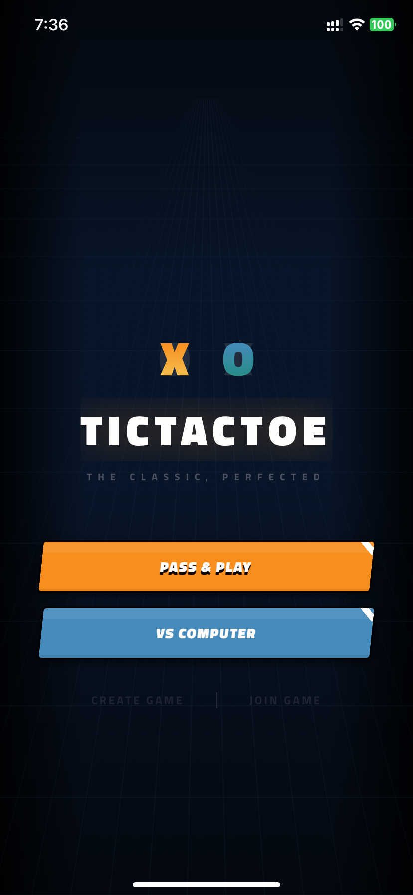
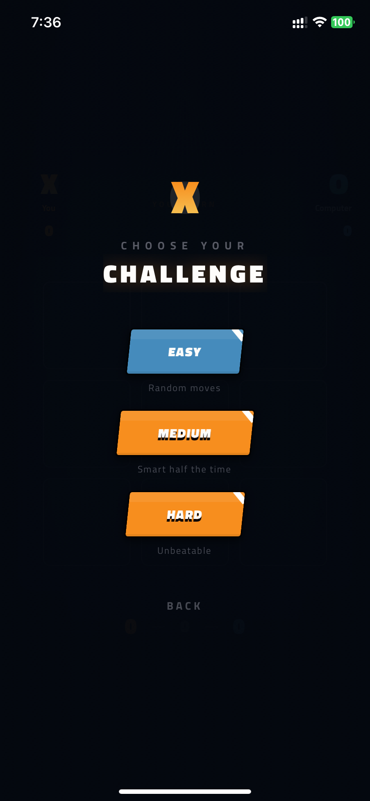
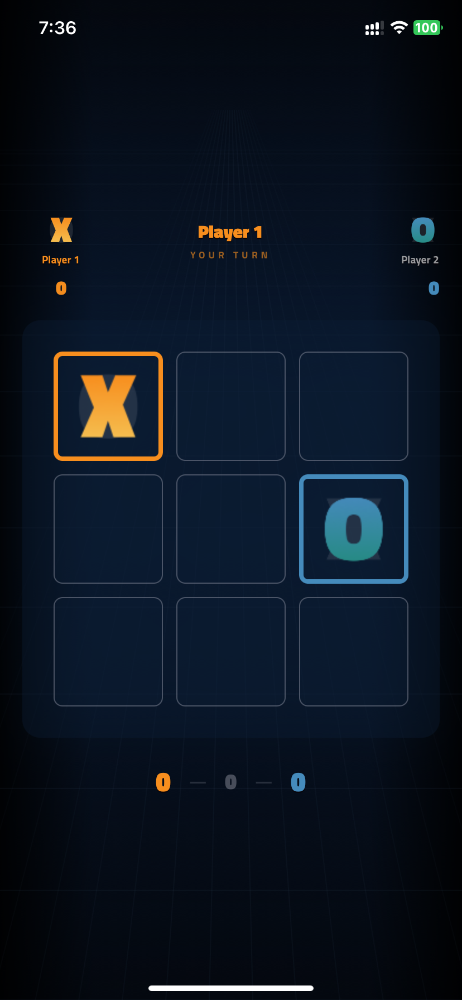
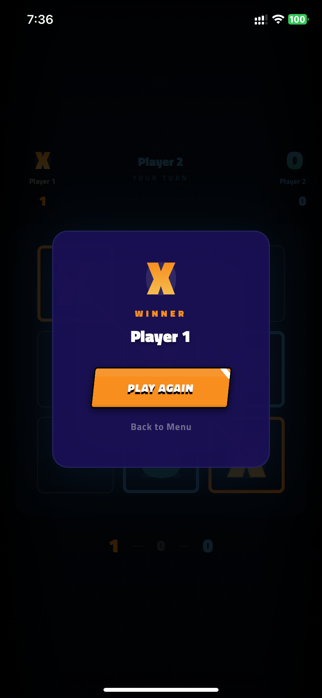

# Tic - TicTacToe

A premium TicTacToe game for iOS built with React Native and Expo.

## Screenshots

<p align="center">
  
  
  
  
</p>

## Features

- **Pass & Play** - Two players, one device
- **vs Computer** - Three difficulty levels (Easy, Medium, Hard) powered by minimax AI
- **Online Multiplayer** - Real-time matches via room codes using Supabase Realtime
- **Sound Effects & Haptics** - Audio feedback on moves, wins, and draws
- **Smooth Animations** - Spring-based mark placement, animated win lines

## Tech Stack

- Expo SDK 54 with Expo Router
- TypeScript
- Zustand (state management)
- React Native Reanimated (animations)
- React Native SVG (game marks)
- Supabase Realtime (online multiplayer)
- Titillium Web (typography)

## Getting Started

```bash
# Install dependencies
npm install

# Start the dev server
npx expo start
```

### Online Multiplayer Setup (Optional)

1. Create a project at [supabase.com](https://supabase.com)
2. Run the SQL migration:

```sql
create table rooms (
  id uuid default gen_random_uuid() primary key,
  code text unique not null,
  status text default 'waiting' check (status in ('waiting', 'playing', 'finished')),
  created_at timestamptz default now()
);
```

3. Copy your credentials:

```bash
cp .env.example .env
# Edit .env with your Supabase URL and anon key
```

## AI Difficulty Levels

| Level  | Behavior                              |
|--------|---------------------------------------|
| Easy   | Random moves                          |
| Medium | 50% optimal (minimax), 50% random     |
| Hard   | Full minimax - unbeatable             |

## Author

**Prashant Koirala**

## License

MIT
